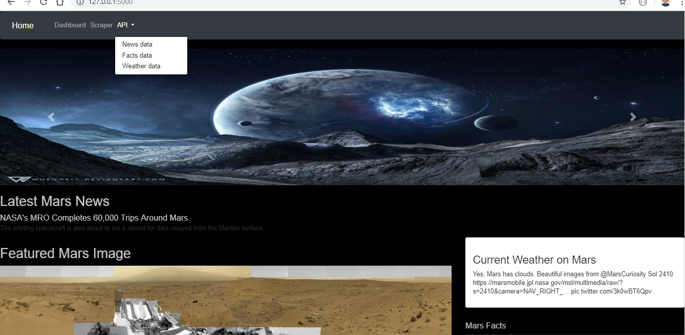
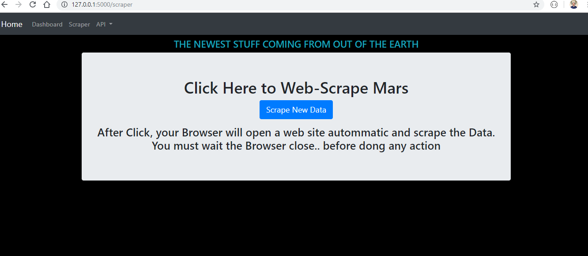

# Shipping-DataDrivenProduct--NASA data

Link:  https://contentmars.herokuapp.com/

# Background

App that shows the most recent news about Mars for the space enthusiast, as well has others features such Dashboard, Data Scraper, and Weather, News, Facts API. 

# Goal

Build a Web based product, challenge will be putting together a multiple variety of technologies, delivering a fully automatic "report" product about mars in a Cool and Instinctive User Interface.    

# Scope 
  
  *Reverse Engineering the target (web-page), find out the <tags> and subcategories 
  *Build the script using Python and Beautiful soap to scrape the data   
  *Uncover patterns in the target(web-page) in order to Automate the script using Functions 
  
  #Parse the data into Data Frame, clean unwanted characters and formatting using Pandas. 
  #Storage it into Database 
  
  #Create an app using Flask  
  #Design Front-End using HTML, CSS  
  #Build the visualizations using javascript 
  #Deploy the page in the web using Heroku 
  
  #Testing and Debugging 

# Tech Stack
  
  #javascript 
  #python 3 
  #HTML 
  #CSS 
  #jupyter notebook 
  #Flask 
  #Heroku 
  #MongoDB 
  #Bootstrap  

  #Splinter lib 
  #Beautiful soap lib 
  #D3 lib 
  #Numpy lib 
  #Pandas lib 
  #Pymongo lib 

# Functionality

#This app in the main page loads the newest news  from Nasa's (https://mars.nasa.gov/news/mars),  
#Images from Nasa's (https://www.jpl.nasa.gov/spaceimages),  
#Weather Tweets from (https://twitter.com/marswxreport), 
#Facts from (https://space-facts.com/mars/), 
#Atmosphere from (https://astrogeology.usgs.gov) 

  #In the Navbar, click in Scraper you active the python program that will scrape data real time. 
  #Also in the Navbar, click in Dashboard there is an Interactive Interface that you can play with the data collected. 
  #At least in the Navbar, Click in API there is available all the historic data that has been collected and stored into the Database in JSON format, you can use it in your Project/Research.

# Design

I chose a familiar design to most, Nasa's web sites. I went with this because I love the simplicity of it and tried make it looks familiar for the users. This is a News report app and the visualizations and credibility are what draw the users in and I wouldn't want to take away from that. The next piece I am building a Interactive Dashboard that allow to measure what users are more interested so see.

# Run Locally
#Run this command git clone https://github.com/Piterbrito/Shipping-Data-Product-Web-based/ 
#Make sure you have installed in your computer all libraries used above  
#Double check if you are in the right directory in you terminal ...that often cause errors 
#Terminal Should be addressed at folder: flask_app 
#Run the command: python app.py in your terminal 
#Copy the output link and paste in your Browser 
#You are now in the dev environment and you can play around 

